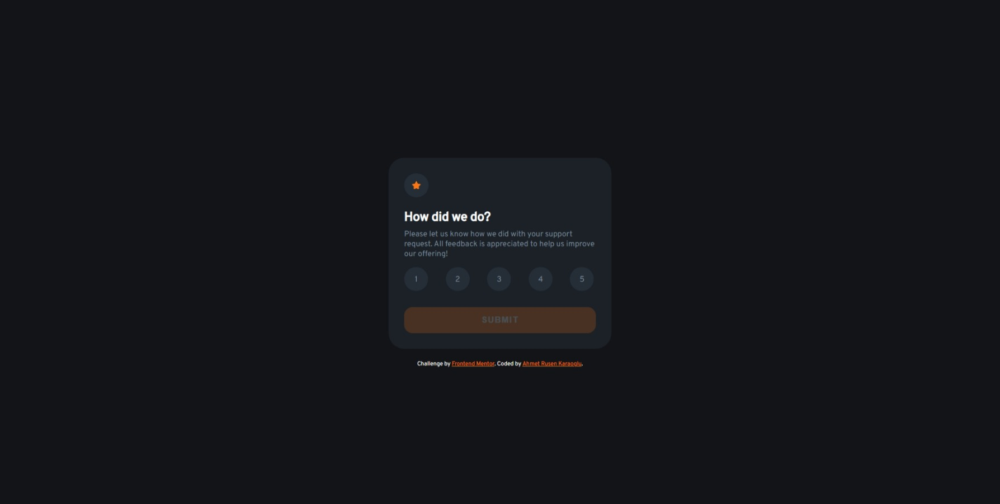

# Frontend Mentor - Interactive rating component solution

This is a solution to the [Interactive rating component challenge on Frontend Mentor](https://www.frontendmentor.io/challenges/interactive-rating-component-koxpeBUmI). Frontend Mentor challenges help you improve your coding skills by building realistic projects.

## Table of contents

-   [Overview](#overview)
    -   [The challenge](#the-challenge)
    -   [Screenshot](#screenshot)
    -   [Links](#links)
-   [My process](#my-process)
    -   [Built with](#built-with)
    -   [What I learned](#what-i-learned)
    -   [Continued development](#continued-development)
    -   [Useful resources](#useful-resources)
-   [Author](#author)

**Note: Delete this note and update the table of contents based on what sections you keep.**

## Overview

### The challenge

Users should be able to:

-   View the optimal layout for the app depending on their device's screen size
-   See hover states for all interactive elements on the page
-   Select and submit a number rating
-   See the "Thank you" card state after submitting a rating

### Screenshot



### Links

-   Solution URL: https://github.com/ARKaraoglu/ FEM-interactive-rating-component-main
-   Live Site URL: https://arkaraoglu.github.io/FEM-interactive-rating-component-main/

## My process

### Built with

-   Semantic HTML5 markup
-   CSS custom properties
-   Vanilla Javascript
-   CSS Grid
-   Desktop-first workflow

**Note: These are just examples. Delete this note and replace the list above with your own choices**

### What I learned

-   I learned how to add event listener to a form to have the desired affect after submit

```js
form.addEventListener("submit", function (e) {
    e.preventDefault();
    ...
})
```

-   I learned how to add rating buttons using label tag

```html
<div class="rating-group">
    <label class="rating-btn rating-1">1</label>
    <label class="rating-btn rating-2">2</label>
    <label class="rating-btn rating-3">3</label>
    <label class="rating-btn rating-4">4</label>
    <label class="rating-btn rating-5">5</label>
</div>
```

```css
.rating-btn {
    text-align: center;
    background-color: hsl(213, 19%, 18%);
    border: none;
    padding: 1em;
    width: 1rem;
    height: 1rem;
    border-radius: 50%;
    color: hsl(216, 12%, 54%);
    transition: 0.3s;
}

.rating-btn:hover {
    background-color: hsl(25, 97%, 53%);
    color: white;
    cursor: pointer;
}

.rating-btn-clicked {
    text-align: center;
    background-color: hsl(217, 12%, 63%);
    border: none;
    padding: 1em;
    width: 1rem;
    height: 1rem;
    border-radius: 50%;
    color: white;
    transition: 0.3s;
}

.rating-btn-clicked:hover {
    background-color: hsl(25, 97%, 53%);
    color: white;
    cursor: pointer;
}
```

-   I have gotten better at building websites such as this using HTML and CSS

### Continued development

-   I would like to add an animation of some sort so the submit process is not so dull. because right now, the form submits and the thank you card appears suddenly. Looks unnatural in my opinion.

### Useful resources

-   W3Schools: https://www.w3schools.com/

-   Stack Overflow: https://stackoverflow.com/

## Author

-   Website - [Ahmet Rusen Karaoglu](https://github.com/ARKaraoglu)
-   Frontend Mentor - [@ARKaraoglu](https://www.frontendmentor.io/profile/ARKaraoglu)
